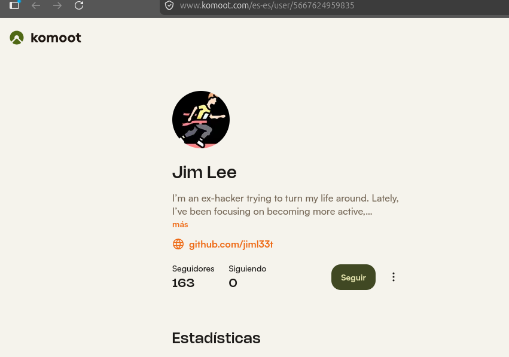
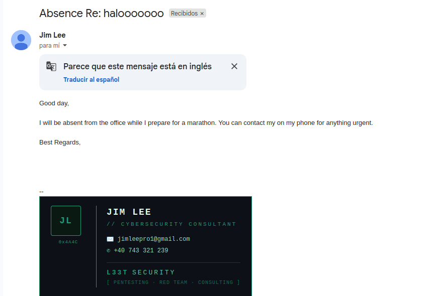
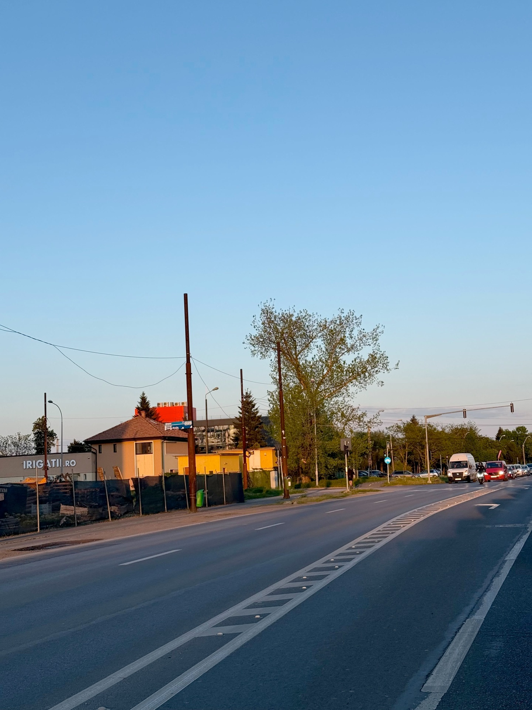
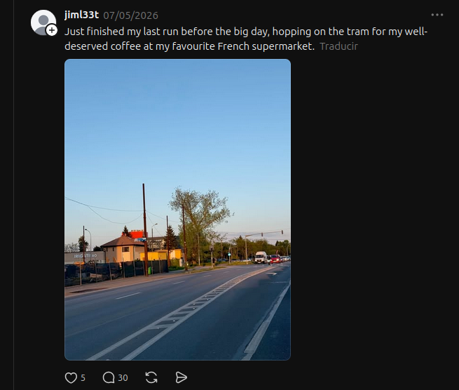

#Cache Me Outside Walkthrough
Este es un reto OSINT, nos dan esta imagen para empezar.

En la imagen que nos dan hay un link de koomot, siguiendo el link encontramos su nombre.

What is the retired hacker’s full name?
Jim ***.

En koomot encuentro un link a github.
https://github.com/jiml33t

Al ver su historial, tan solo tiene un commit el 16 de abril de 2026.

Uso Curl para ver los datos completos del commit.

curl -H "Accept: application/vnd.github+json" \
     "https://api.github.com/repos/jiml33t/jiml33t/commits"
[
  {
    "sha": "7b2c8e0a540c36f2e09da5945066020621d6a059",
    "node_id": "C_kwDOSEE4k9oAKDdiMmM4ZTBhNTQwYzM2ZjJlMDlkYTU5NDUwNjYwMjA2MjFkNmEwNTk",
    "commit": {
      "author": {
        "name": "jimleepro1-cell",
        "email": "jim************",
        "date": "2026-04-16T07:27:19Z"
      },
      "committer": {
        "name": "GitHub",
        "email": "noreply@github.com",
        "date": "2026-04-16T07:27:19Z"
      },
      "message": "Initial commit",
      "tree": {
        "sha": "3e58d226fe6c70d1e870054269d448d915f824d1",
        "url": "https://api.github.com/repos/jiml33t/jiml33t/git/trees/3e58d226fe6c70d1e870054269d448d915f824d1"
      },
      "url": "https://api.github.com/repos/jiml33t/jiml33t/git/commits/7b2c8e0a540c36f2e09da5945066020621d6a059",
      "comment_count": 1,
      "verification": {
        "verified": true,
        "reason": "valid",
        "signature": "-----BEGIN PGP SIGNATURE-----\n\nwsFcBAABCAAQBQJp4I9XCRC1aQ7uu5UhlAAAYoIQAA7s06lY5W6lxdAlGfkcAJ58\ndPnXAU5fySCUT0r0W9MbzPDFcZ2zhCJozg+j0ElCkrEKhy7Kb1DOONX/5X0yJK3z\n5aolXLgsQkRMySnwC4uzsqlomKzr/NISzNxpvDGm7LuTKrnpu8bSf8gCrMlogP6a\nEQf+VCtGIiP1egC+RLUbOXLocdUA4F3wzeM0BHb3b2JvkP5OF+8auv8ajexFbfK/\n2WeGuoRNh6GaQ/Y/GkgR20yeJI5mtVAsNEY4nJ030wt1vzDL0bvcvtOHp6+Lumf3\neoWWjJIXmQKT3tTZQp2457kYf47Q06CRS4rVHFcTKmA5supArxewJz7o2bzF4viN\nG/vZDA5wpTLJntZHtZlhYdt4PIRRDBW1EWAa2Lih52QlO2vSBxx600tz8QgCAzie\n8zVjU9lZs6fk/mhBknBDOS35RrfPjWBdK5Phg9aFVbl30ncuVJTirsocTCeuFA1T\nZKYC2q78kmSVuHQnF7EuVSBpK/Zz5+hGf+SHiefzlQ60b3W2ztekzcDEim8kEt0C\nkPBkCdpUZPrx9biG4qODn7JW3qc/ZOSNZPzEv3v5Ufh2WFrCbDnR0NCQC/6yujEP\nZz7b4whzS3isrJTjP3XUSRWtgIN+ggam/QaiKYdlmxmWQsAn/mVUDnPozs8U8/v3\nmV9FQba2WeI5JBblpbxq\n=21Y1\n-----END PGP SIGNATURE-----\n",
        "payload": "tree 3e58d226fe6c70d1e870054269d448d915f824d1\nauthor jimleepro1-cell <jimleepro1@gmail.com> 1776324439 -0400\ncommitter GitHub <noreply@github.com> 1776324439 -0400\n\nInitial commit",
        "verified_at": "2026-04-16T07:27:20Z"
      }
    },
    "url": "https://api.github.com/repos/jiml33t/jiml33t/commits/7b2c8e0a540c36f2e09da5945066020621d6a059",
    "html_url": "https://github.com/jiml33t/jiml33t/commit/7b2c8e0a540c36f2e09da5945066020621d6a059",
    "comments_url": "https://api.github.com/repos/jiml33t/jiml33t/commits/7b2c8e0a540c36f2e09da5945066020621d6a059/comments",
    "author": {
      "login": "jiml33t",
      "id": 276522146,
      "node_id": "U_kgDOEHtkog",
      "avatar_url": "https://avatars.githubusercontent.com/u/276522146?v=4",
      "gravatar_id": "",
      "url": "https://api.github.com/users/jiml33t",
      "html_url": "https://github.com/jiml33t",
      "followers_url": "https://api.github.com/users/jiml33t/followers",
      "following_url": "https://api.github.com/users/jiml33t/following{/other_user}",
      "gists_url": "https://api.github.com/users/jiml33t/gists{/gist_id}",
      "starred_url": "https://api.github.com/users/jiml33t/starred{/owner}{/repo}",
      "subscriptions_url": "https://api.github.com/users/jiml33t/subscriptions",
      "organizations_url": "https://api.github.com/users/jiml33t/orgs",
      "repos_url": "https://api.github.com/users/jiml33t/repos",
      "events_url": "https://api.github.com/users/jiml33t/events{/privacy}",
      "received_events_url": "https://api.github.com/users/jiml33t/received_events",
      "type": "User",
      "user_view_type": "public",
      "site_admin": false
    },
    "committer": {
      "login": "web-flow",
      "id": 19864447,
      "node_id": "MDQ6VXNlcjE5ODY0NDQ3",
      "avatar_url": "https://avatars.githubusercontent.com/u/19864447?v=4",
      "gravatar_id": "",
      "url": "https://api.github.com/users/web-flow",
      "html_url": "https://github.com/web-flow",
      "followers_url": "https://api.github.com/users/web-flow/followers",
      "following_url": "https://api.github.com/users/web-flow/following{/other_user}",
      "gists_url": "https://api.github.com/users/web-flow/gists{/gist_id}",
      "starred_url": "https://api.github.com/users/web-flow/starred{/owner}{/repo}",
      "subscriptions_url": "https://api.github.com/users/web-flow/subscriptions",
      "organizations_url": "https://api.github.com/users/web-flow/orgs",
      "repos_url": "https://api.github.com/users/web-flow/repos",
      "events_url": "https://api.github.com/users/web-flow/events{/privacy}",
      "received_events_url": "https://api.github.com/users/web-flow/received_events",
      "type": "User",
      "user_view_type": "public",
      "site_admin": false
    },
    "parents": [
]
  }
]

En el campo email esta la segunda flag.

What email address did he accidentally expose?
"email": "jim**********l.com"

La siguiente flag es un numero de telefono. Tan solo tengo un correo y una cuenta de koomot.
He buscado cuentas de correo o usuarios como jimleepro1, jiml33t, he usado holehe para ver servicios en los que haya usado esa cuenta, sin éxito.
He encontrado una cuenta de instagram y otra de threads, pero no su número.

He enviado un correo, y tiene una respuesta programada.

En la imagen se puede ver su número de teléfono y una posible compañia, L33t Security.

What is his phone number?
+40 *** *** *** // Tengo la tercera flag.
// +40 de prefijo indica que el número es rumano.

La siguiente flag nos pide su ciudad. Sabiendo la que L33t Security es su empresa y su número, sabemos que es rumano.
Vuelvo a la cuenta de threads que habia encontrado antes, en la que estaba esta imagen.

Se ve un letrero que pone irigatii.ro.

Buscando un poco en google, es una empresa de jardinería que esta en la siguiente dirección.
Calea Buziașului 13, 300701 Ti********, Rumanía
Timișoara es la ciudad.

In which city is he located?
Ti********* //cuarta flag

Basándome en el post de threads, jim se estaba preparando para una maratón, y se sube al tram para ir a por un café a su supermercado francés favorito.
Esto nos indica que es una estación de tram cercana a un supermercado francés. Me imagino que un carrefour o algo similar.

La cuarta flag nos pide que digamos en que estación de tram se bajó el 7 de mayo.

Preguntado a gemini, me da las líneas de tram que están cerca de ese lugar.

El showroom y sede principal de Irigatii.ro en Romania se encuentra ubicado en Calea Buziașului nr. 13, Timișoara.Estaciones de Tranvía más cercanas: Las paradas de la red de tranvías de Timișoara más próximas al almacén son Stadion (aprox. 150 metros) y Banatim (aprox. 500 metros), ambas atendidas por las líneas 4 y 8.

Líneas 4 y 8.
He encontrado un par de paradas de la línea 8 y una de la 4 cerca de un carrefour, pero no son la respuesta.
He buscado más cadenas de supermercados franceses en rumanía, y al parecer también tienen presencia Auchan y Cora (esta ha sido adquirida por Carrefour).

Al buscar paradas de estas dos líneas cerca de un supermercado Auchan, he encontrado una solo respuesta viable.
Piața ****** *********** ***** (Liviu Rebreanu - AEM)

Submit the name of the tram station where he got off on the 7th of May, 2026.
Piața ************** *************(Liviu Rebreanu - AEM) // Esta es la última flag
